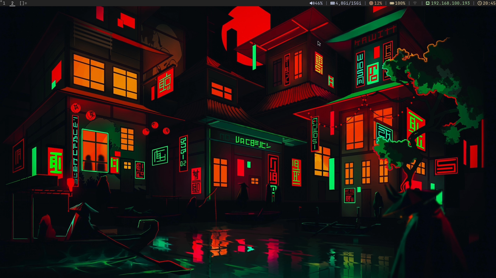

# dwm - dynamic window manager

My personal build of **dwm**, the dynamic window manager from suckless.

This repository contains my customized `dwm` source code with a collection of patches and personal configuration. Every major change is committed individually to make the history easier to understand and follow.

## Preview

## Patches

* attachaside
* systray
* hide_vacant_tags
* underlinetags
* status2d
* restartsig
* fullgaps
* autostart
* pertag
* restore_after_restart

## Status Bar

The `scripts/` directory contains the scripts used for my status bar.

* `statusbar.sh` – Original status bar script.
* `bar.sh` – Updated version designed to work with the `status2d` patch, providing colored status text.
